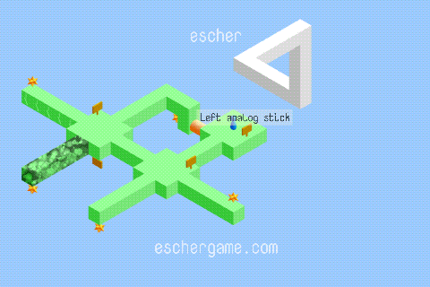
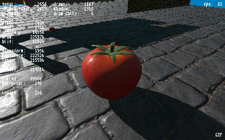

A single-header animated GIF exporter, suitable for recording gifs in realtime.
* **Easy to use**. Single-header C89 code, depending only on the C standard library. Simple and minimal API.
* **High-quality results**. Uses a unique color selection and dithering algorithm that is guaranteed to produce consistent results, thereby avoiding artifacts that are typical of the kind of adaptive palettization algorithms used in most gif encoders.
* **Small file sizes**. Uses delta encoding between frames, and a compression-friendly dithering kernel, resulting in significantly smaller files than most gif encoders without sacrificing quality.
* **Fast**. Designed for speed, and uses SSE where available to encode at hundreds of megabytes a second, several times faster than other gif libraries.
* **Public domain**. Also available under MIT license, if the company you work for is scared of the public domain, as some are.
* **Actively maintained**. This is not abandonware! If there is a problem or a feature you feel is missing, tell me and there's a good chance I can add it. Or submit a pull request if you're feeling generous - the code is relatively short and simple.

## Examples

[](https://eschergame.com/)

[](https://github.com/notnullnotvoid/DIWide)

## How to use

In **exactly one** translation unit (.c or .cpp file), `#define MSF_GIF_IMPL` before including the header, like so:
```cpp
#define MSF_GIF_IMPL
#include "msf_gif.h"
```
Everywhere else, just include the header like normal.

### Usage example

```cpp
int width = 480, height = 320, centisecondsPerFrame = 5, bitDepth = 15;
MsfGifState gifState = {};
msf_gif_begin(&gifState, "example.gif", width, height);
msf_gif_frame(&gifState, ..., bitDepth, centisecondsPerFrame, width * 4, false); //frame 1
msf_gif_frame(&gifState, ..., bitDepth, centisecondsPerFrame, width * 4, false); //frame 2
msf_gif_frame(&gifState, ..., bitDepth, centisecondsPerFrame, width * 4, false); //frame 3, etc...
msf_gif_end(&gifState);
```
Detailed function documentation can be found in the header.
